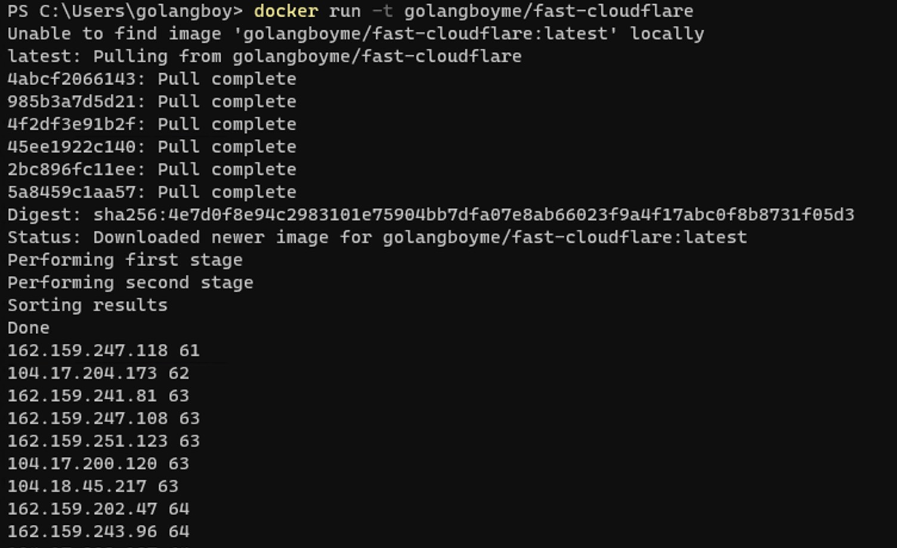

[中文版](./README_zh.MD) | [English](./README.MD)

# 📖 介绍
对CloudFlare的所有IP节点进行扫描，找出最快的IP节点

# ⚡️ 开始
## 🔨️ 构建
```bash
git clone https://github.com/golangboy/fast-cloudflare
cd fast-cloudflare
cargo run
```
> 请确保你安装好了Rust环境

扫描结果将保存在`result\sorted_ping_ip.txt`下
## 🐳 Docker
```bash
docker run -t golangboyme/fast-cloudflare
```
